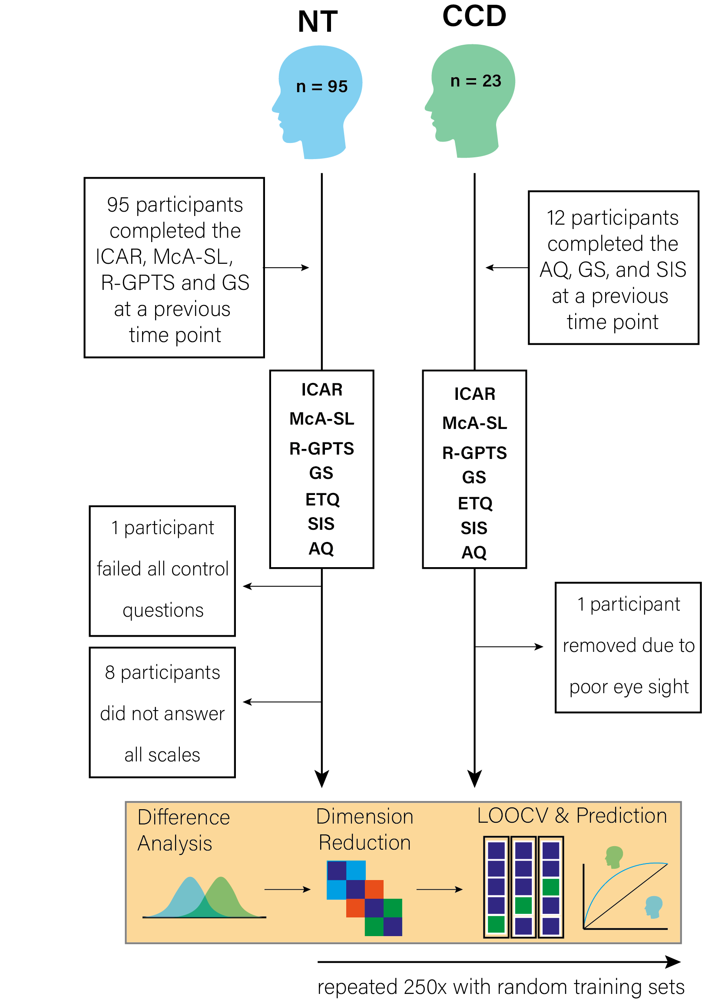

# Barnby et. al (2021) Increased persuadability and credulity in people with corpus callosum dysgenesis

<!-- CC BY-NC-SA 4.0 License -->

 
This work is licensed under a <a rel="license" href="http://creativecommons.org/licenses/by-nc-sa/4.0/">Creative Commons Attribution-NonCommercial-ShareAlike 4.0 International License</a>.

Please contact Joe Barnby for all code related issues and problems.

## Study design

## Data

All data is anonymised. This means that only the IDs from neurotypical (NT) participants are obscured, however, we have also removed the age and sex of participants with a diagnosis of Corpus Callosum Dysgensis (CCD) as they are a vulnerable population. If you wish to retrieve this personal data you may request it from the authors following ethical approval.

### For the adjusted and unadjusted analysis:

 - All psychometric data for every participant is available.
 - All education level data is available

### For the machine learning model:

 - All psychometric data for every participant (NT & CCD) is available before age and sex have been regressed out.
 - All psychometric data for every participant (NT & CCD) is available after age and sex have been regressed out.
 - All data used for our figures are available for reproducibility. 

## Analysis

- Run on R 4.0.0 (MacBook High Sierra)
- If the /data file is loaded into your working directory and you have installed all packages listed in the 'Libraries' section, the code should run and reproduce all figures and analysis outcomes exactly.
- There are a few commented out sections. This is because permutation analyses use random seeds to draw on subsections of our NT population for dimension reduction, and therefore will produce slightly different results everytime. To reproduce our data from the paper just run the code as is without uncommenting any lines. If you wish to run your own permutations using the code, just uncomment out the code and run the script. 

